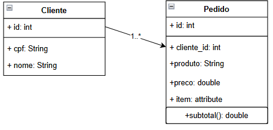
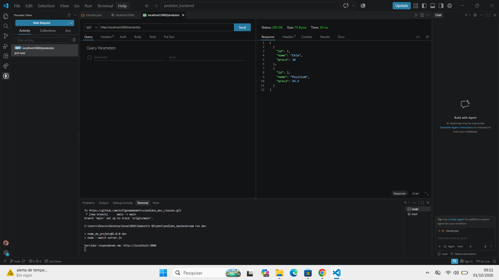
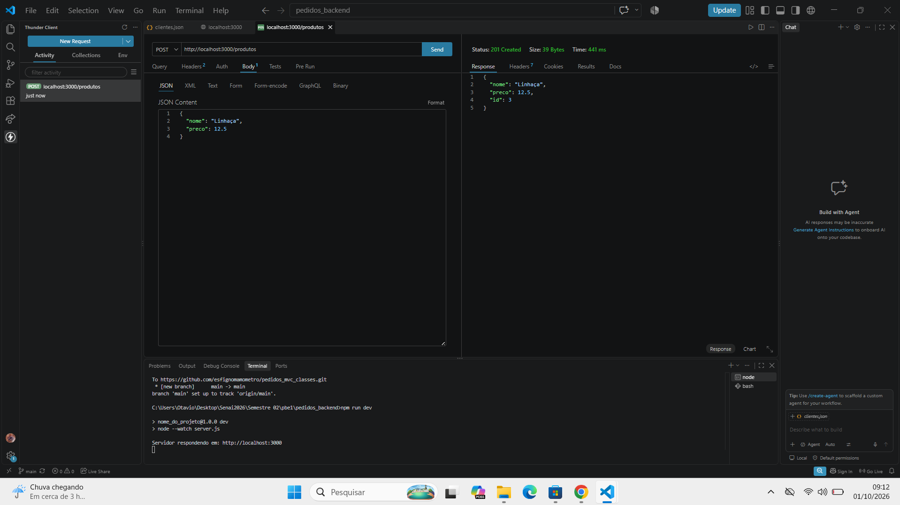
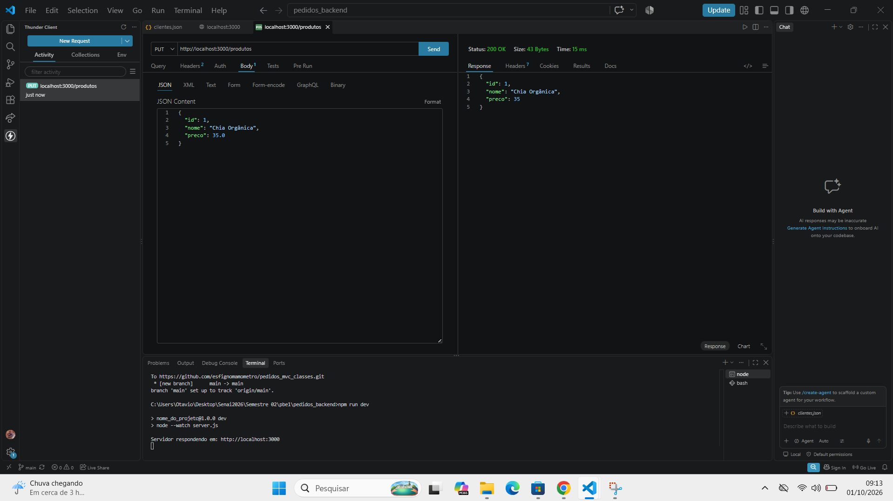
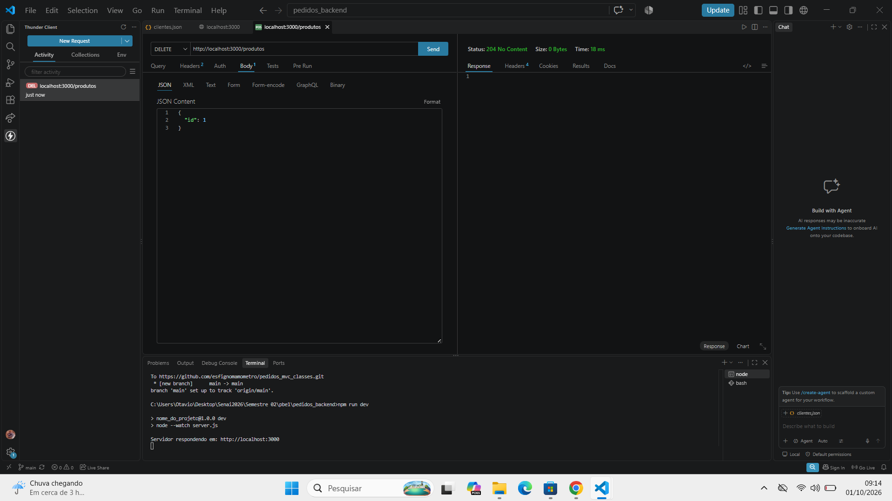

# Pedidos Backend MVC DC

Backend contendo pedidos e clientes

## Diagrama UML

## Evidências dos Testes (Thunder Client)

### GET (Listar)

### POST (Cadastrar)

### PUT (Alterar)

### DELETE (Excluir)

### Tecnologias
 /Node.js